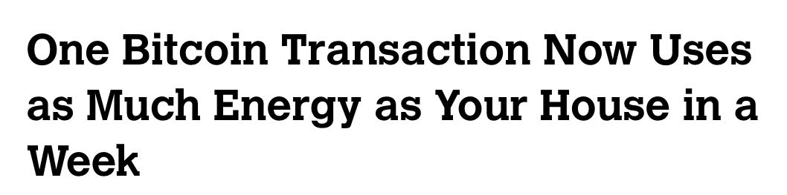
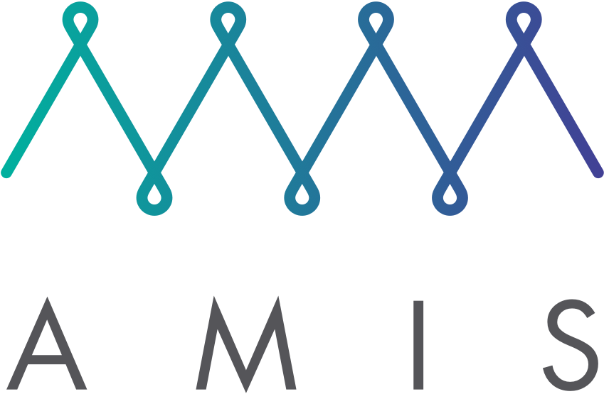

theme: Plain Jane, 4

# Quorum

---

^ We'll start with some context for the project. What a bank might want to do with a blockchain and what ethereum provides.

# Motivation

* Use Cases
* Ethereum as a starting point

---

^ I'll discuss two different use cases

^ First, an information sharing network. For global payments, banks are required to share information about the sender and recipient, to prevent eg money laundering, terrorism funding, fraud, etc. We don't want to broadcast all this information, obviously. Instead, we want a model with peer-to-peer privacy. We use a blockchain so everyone in the network owns it and to make regulation easier.

^ Credit Default Swap: As a concrete example, consider some bank which has lent money to a business, ACME. They receive payment from ACME, but lose the entire amount if ACME defaults. To hedge against this risk, they use a CDS. Imagine now some hedge fund can buy this "credit default swap". The hedge fund receives some amount of money every month from the bank, but in exchange they promise to pay the entirety of the loan if ACME defaults. Thus the hedge fund makes some money by taking on this risk, while the bank is insured.

^ I imagine the way this currently operates (I'm not an expert) is that each organization maintains a database of the CDSes they're engaged in. When a swap is triggered, both counterparties need to agree and execute it.

^ If these engagements were instead encoded as blockchain contracts, execution would be automatic. Because everyone is running exactly the same code, there is no duplicated effort and no more disputes.

# Motivation: Use Cases

* Interbank Information Network
* Credit Default Swap


---

^ Now let's talk about Ethereum as a starting point by comparing it to a conventional distributed database. By distributed database, you can imagine Google's BigTable, or something similar. Operated by a single company, but providing redundancy. These typically use a consensus mechanism like PAXOS or Raft.

# Motivation: Ethereum as a starting point

| Distributed Database | Public blockchain |
| --- | --- |
| closed, single operator | open, multiple operators |
| trust among nodes | trustless, censorship resistant |
| fast, capable of strong consistency | slow, eventual consistency |
| store of mutable state | log of state transitions |

---

^ Is there a middle ground between conventional distributed database and public blockchain?

^ By starting with Ethereum, replacing its consensus mechanism, and adding peer-to-peer privacy, we achieve a useful middle ground.

# Motivation: Ethereum as a starting point

| Distributed Database | ... | Public blockchain |
| --- | --- | --- |
| closed, single operator | multiple known operators | open, multiple operators |
| trust among nodes | accountability | trustless, censorship resistant |
| fast, capable of strong consistency | strong, not eventual consistency | slow, eventual consistency |
| store of mutable state | log of state transitions | log of state transitions |

---

# Motivation: Ethereum as a starting point

Also:

* confidential transactions
* real-world governance (tech _and_ law)
* enterprise deployment + support

---

# Simple privacy

---

# Simple privacy

Two separate state trees


---

# Simple privacy: Constellation

## Ethereum network

^ We start with an ethereum network. These are five nodes building a blockchain.


---

# Simple privacy: Constellation

^ it's a blockchain on a machine

One node.


---

# Simple privacy: Constellation

^ We add a private enclave

^ constellation holds encrypted private data

^ quorum can send or request private data

With a private enclave.


---

^ Now add constellation nodes. Each of the constellation nodes is colocated with its quorum node and communicates peer-to-peer with other constellation nodes when necessary to share private, encrypted information.

^ quorum nodes communicate in a network

^ constellation nodes do too

# Simple privacy: Constellation

## Quorum network

Peer-to-peer encrypted message exchange


---

^ mention we don't use ether

# Simple privacy: Creating a private contract

```javascript
var simple = checkingAccountContract.new(42, {
  from: web3.eth.accounts[0],
  data: bytecode,
  gas: 300000,
});
```

---

^ we probably include a regulator in all private txes

# Simple privacy: Creating a private contract

```javascript
var simple = checkingAccountContract.new(42, {
  from: web3.eth.accounts[0],
  data: bytecode,
  gas: 300000,

  privateFor: ["ROAZBWtSacxXQrOe3FGAqJDyJjFePR5ce4TSIzmJ0Bc="]
  //           <-               public key                 ->
});
```

---

# Simple privacy: Creating a private contract


---

^ A natural question to ask is, how do we arrive at consensus on private state?

^ We have a list of transactions. The top three are public while the bottom two are private.

^ For the private transactions we simply replace the payload / data with a hash of the encrypted data stored in our constellation enclave.

^ possibly mention V twiddling

^ In this slide, our quorum node (on the left) asks its constellation node for the private payload.

# Simple privacy: consensus with private state


---

^ each quorum node asks for the private data

# Simple privacy: consensus with private state


---

# Simple privacy: consensus with private state

Who has this payload?


---

^ constellation knows this payload, so quorum can execute it

# Simple privacy: consensus with private state


---

# Simple privacy: consensus with private state


---

^ in this case constellation doesn't have the payload, so quorum skips executing this transaction

# Simple privacy: consensus with private state


---

# Simple privacy: Calling other contracts

* private contracts can call other private contracts

* private contracts can also call public contracts

* but...

---

^ demo1: creating a private contract

^ demo2: messaging between private contracts

^ demo3: failure to call public from private contract

# Simple privacy: demo

---

# Consensus

---

^ possible questions on proof of stake

^ Proof of work is an economics-based security model. Your vote is weighted in proportion to the resources you're willing to contribute to the system. As long as no individual can amass enough resources to overrule, the system is secure.

^ But what happens if we remove anonymity / add known identities?

# Consensus: Proof of work

* everyone is anonymous
* mutual lack of trust
* mining power as proxy for:
  * investment in the network
  * how much of the vote you get



---

^ In a setting where we know everyone, this all becomes so much easier.

^ This raises the question of what happens if someone tries to cheat. The idea is that I could call up my peer at the other bank and say "hey, the transactions you send were invalid." Or more realistically, alert a regulator. Or, the regulator's node, which is validating all transactions, automatically sends up a red flag.

# Consensus: Enterprise

* everyone is ~~anonymous~~ known
* mutual ~~lack of~~ trust
* mining is not necessary

---

# Consensus: Raft

What does a consensus mechanism do?

| | |
|---|---|
| 1 | a = 1 |
| 2 | b = 2 |
| 3 | a = 100 |
| 4 | c = 5 |

---

# Consensus: [Raft](https://raft.github.io/)

> "Raft is a consensus algorithm that is designed to be easy to understand. It's equivalent to Paxos in fault-tolerance and performance."

---

# Consensus: Raft

* Formally verified protocol
* We use the etcd implementation, which is written in Go and not verified, but mature

---

^ Raft has a trusted leader and is vulnerable to censorship. we could add an "elect new leader" message, but this is a kludge.

^ (only cover censorship on this slide)

# Consensus: Raft strengths, weaknesses, and limitations

* Censorship
* Cluster size
* Throughput / latency
* No forking

---

^ Clusters of 3 and 5 are typical in traditional raft deployments

^ tested with dozens of nodes

^ note that quorum is not Quorum

# Consensus: Cluster size

| Servers | Quorum Size (majority) | Failure Tolerance |
|---|---|---|
| 1 | 1 | 0 |
| 2 | 2 | 0 |
| 3 | 2 | 1 * |
| 4 | 3 | 1 |
| 5 | 3 | 2 * |
| ... | ... | ... |

---

^ We've done some testing which shows we can do about 1100 very simple transactions per second in good conditions. I believe the bottleneck is sequential contract execution. At the moment this is difficult to work around, though there is a proposal to add simple concurrency to the EVM.

# Consensus: Throughput / Latency

* Up to 1100 tx / s (ideal conditions)
* 0 - 50 ms latency

---

^ TODO: diagram of transaction messaging / difference between txes and blocks / speculative chain

^ Ethereum has the notion of miner, which we call the "minter". This lines up with Raft's notion of a leader.

^ This is all completely opaque to applications running on top of Raft and Quorum

^ Why do we do it this way? Two reasons:

^ 1. Raft ensures there's only one leader at a time, and we want some way to have one miner at a time

^ 2. This has the most efficient network usage.

^ [TODO: note on correctness: "Chain extension, races, and correctness"]

# Consensus: Ethereum and Raft

| Ethereum | Raft |
| --- | --- |
| ~~miner~~ minter | leader |
| verifier | follower |

---

# Consensus: Ethereum and Raft

## "Speculative minting"

* Mint every 50ms
* Raft can take arbitrarily long to confirm blocks

---

# Consensus: Istanbul BFT

* Based on PBFT [Castro-Liskov 99]
* Up to `F` of `N` faulty nodes (`N = 3F + 1`)
* Doesn't scale to as many nodes
* Censorship resistant



---

^ bft + bigger networks + more efficient

# Consensus: New work

* The Honey Badger of BFT Protocols - Miller, Xia, Croman, Shi, Song
* Thunderella: Blockchains with Optimistic Instant Confirmation - Pass, Shi

---

### `assert(presentationEnded);`

---

# Appendix

If we have time

---

# ZSL

* What is zero-knowledge proof?
* Non-interactive zero-knowledge proof
* zk-SNARKs
* ZSL
* Applications
* Demo

---

# ZSL: What is zero-knowledge proof?

---

# ZSL: Non-interactive zero-knowledge proof

> a variant of zero-knowledge proofs in which no interaction is necessary between prover and verifier

Intuition?
